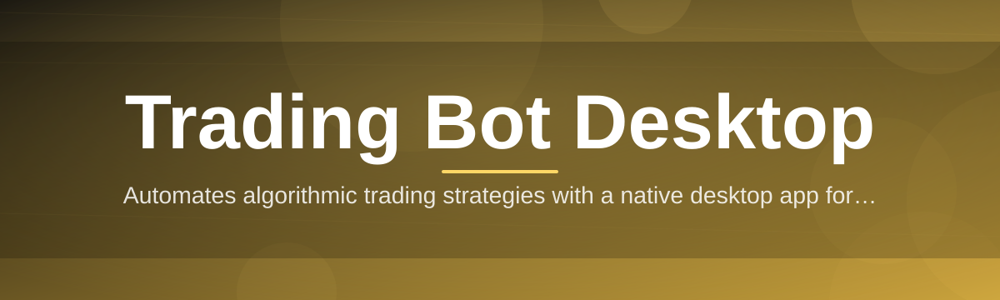
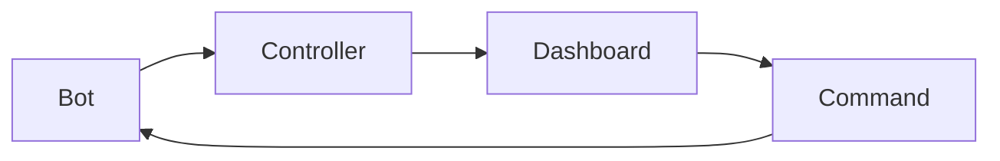

# trading-bot-desktop-controller 🤖📈

  

*Your trading bots, finally under one roof — a desktop control tower instead of a dozen scattered terminal windows.*

---

## 🧭 Overview

If you've ever run more than one automated strategy at a time, you know the drill: three terminal windows, two browser tabs, a spreadsheet nobody trusts, and a Discord webhook that pings you at 3am for something that turns out to be a rounding error. **trading-bot-desktop-controller** exists because managing algorithmic trading bots shouldn't feel like juggling flaming torches while riding a unicycle. It's a native Windows desktop application built to sit on top of your existing bots and give you one clean, visual command center for starting, stopping, monitoring, and tuning them.

This project was born out of a very ordinary frustration in the Trading Bot Desktop space: most bot frameworks are headless by design — great for servers, rough for humans. We wanted a **local-first, dependency-free** control surface that respects the fact you're running real capital through automated logic and deserves better feedback than a scrolling log file. No cloud account required, no mandatory subscription, no telemetry phoning home in the background.

Whether you're a solo quant tinkering with a mean-reversion script on your gaming rig, or someone running a small fleet of bots across multiple exchanges and paper accounts, the desktop controller is meant to be the layer between "my strategy runs" and "I actually understand what my strategy is doing right now." It's for builders, tinkerers, and anyone who wants their Trading Bot Desktop setup to feel less like a science experiment and more like a cockpit.

  

---

## 📋 Requirements at a Glance

| Requirement | Details |
|---|---|
| **OS** | Windows 10 (64-bit) or Windows 11 |
| **RAM** | 4 GB minimum, 8 GB recommended |
| **Disk Space** | ~250 MB free |
| **Dependencies** | None — fully standalone, no runtime installs needed |
| **Network** | Optional (only needed if your bots connect to remote exchanges/APIs) |
| **Account** | Not required — runs entirely local |

> [!NOTE]
> This is a **controller**, not a trading strategy itself. You bring the bot logic (or connect existing ones); this app brings the visibility, control, and sanity.

---

  

## ⚡ What Actually Changed (Capabilities)

The problem with most "trading bot dashboards" is they're either a bloated web app that needs a browser, a database, and a prayer — or a bare console that gives you nothing but text. Here's what we built instead:

- **Unified bot roster** — see every running, paused, or crashed bot in one panel instead of hunting through terminal history. No more "wait, which window is the one that's actually still trading?"

- **One-click start/stop/pause** — control individual bots or the entire fleet at once, without touching a command line ever again.

- **Live P&L strip** — a compact, always-visible profit/loss readout per bot and aggregated across your whole desktop session.

- **Event timeline, not a log wall** — trades, errors, reconnects, and strategy signals are shown as readable timeline entries instead of a raw text firehose you have to squint at.

- **Kill-switch panic button** — one keystroke halts every connected bot immediately. Built for the moment things go sideways and you need to stop, not scroll.

- **Config snapshots** — save and restore full bot configurations so you can A/B test parameter tweaks without losing your previous setup.

- **Local-only data storage** — nothing about your bots, keys, or trade history leaves your machine unless you explicitly export it.

- **Multi-strategy grouping** — tag and cluster bots by strategy type, exchange, or risk tier so your dashboard scales with your ambition, not against it.

> [!TIP]
> Group your bots by *risk tier* rather than by exchange — it makes the panic button's blast radius much easier to reason about during volatile sessions.

---

## 🚀 How to Get Started

<strong>Click to expand the setup walkthrough</strong>

1. **Visit the landing page** using the download button above — that's the only official source for the app.

2. **Download the Windows package** for the 2026 release.

3. **Run the application** — it's a standalone executable, no installer wizard, no admin rights hunting.

4. **Connect or point it at your existing bots**, then arrange your dashboard layout the way your brain actually works.

> [!IMPORTANT]
> Always download from the official landing page linked in this README. Third-party mirrors are not affiliated with this project and may not reflect the real 2026 release.

---

## 🖥️ System Requirements

<strong>Full requirements breakdown</strong>

- **Operating System:** Windows 10 64-bit or Windows 11

- **Architecture:** x64

- **Dependencies:** None — the controller ships as a self-contained standalone build

- **Storage:** ~250 MB for the app, plus space for logs/config snapshots you choose to keep

- **GPU:** Integrated graphics are fine; this isn't a rendering-heavy app

- **Permissions:** Standard user account, no elevated privileges required to run

---

## 🧩 How It Works

The architecture is intentionally simple — a desktop shell wrapping a lightweight control layer, not a distributed system pretending to be simple.

1. **Bots connect** to the controller through a local interface layer.
2. **The controller polls state** — status, positions, P&L — on a short interval.
3. **Events get normalized** into the timeline format the UI understands.
4. **You act** — pause, tweak, or panic-stop — and commands flow back down to the bot process.
5. **Everything renders** live in the dashboard without a page reload or restart.

---

## 🛟 Troubleshooting

<strong>Q&A: things that trip people up</strong>

**Q: My bot shows "Connected" but the P&L strip stays at zero — what's wrong?**
A: Usually the bot hasn't emitted its first heartbeat event yet. Give it one polling cycle, or check that your bot's output isn't buffered.

**Q: The kill-switch stopped my bots but they still show "Running."**
A: The kill-switch halts trading activity immediately, but process shutdown can lag a second or two on slower machines — the status will catch up.

**Q: Can I run this alongside my broker's own desktop app?**
A: Yes, the controller doesn't touch broker sessions directly — it only talks to the bots you connect to it.

**Q: Config snapshot won't restore correctly after an update.**
A: Snapshots are versioned; if you skipped a major release, re-save the snapshot once after updating to refresh its schema.

**Q: Windows flagged the executable on first run.**
A: This is common for new standalone Windows binaries without a long-standing certificate reputation — verify you downloaded it from the official landing page and proceed if satisfied.

**Q: The dashboard feels laggy with many bots running.**
A: Try grouping bots and collapsing inactive groups — the render load scales with visible widgets, not total bot count.

---

## 🎨 UI / UX Details

<strong>Shortcuts, themes, and settings</strong>

| Shortcut | Action |
|---|---|
| `Ctrl + K` | Open command palette |
| `Ctrl + P` | Panic stop — halts all bots |
| `Ctrl + G` | Group/ungroup selected bots |
| `Ctrl + S` | Save current config snapshot |
| `F5` | Force refresh dashboard state |

- **Themes:** Dark (default), Light, and a high-contrast mode for long monitoring sessions.

- **Layout:** Panels are dockable and resizable — build your own cockpit.

- **Notifications:** Toast alerts for errors, disconnects, and threshold breaches, tunable per bot.

> [!WARNING]
> Disabling all notifications will also silence the kill-switch confirmation toast — keep at least critical-level alerts enabled.

---

## 🤝 Contributing & Community

We welcome issues, feature requests, and pull requests. This project grows because people using it for real Trading Bot Desktop workflows keep pushing on its rough edges.

> [!TIP]
> Before opening a feature request, check existing issues — there's a decent chance someone already proposed your dream widget.

- Open an issue describing the problem, not just the desired feature — context helps us design better solutions.
- Small, focused pull requests get reviewed faster than sprawling ones.
- Be kind. Everyone here is trying to make their bots less chaotic, same as you.

---

## 📜 License

Released under the [MIT License](LICENSE), 2026.

---

## ⚠️ Disclaimer

This software is a control and monitoring tool for automated trading bots. It does not provide financial advice, does not guarantee profitability, and trading involves real risk of loss. Use at your own discretion, test thoroughly with paper accounts before connecting live capital, and never run automated strategies you don't fully understand.

  

